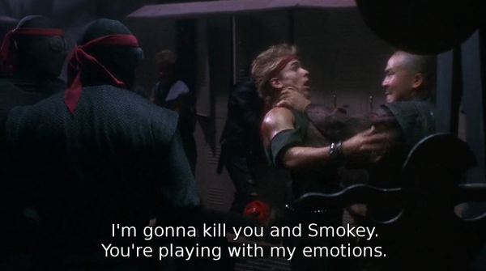

# misc-scripts

This is just a random collection of simple scripts that aren't complex enough to warrant their own project.

## adobe.sh
A script that searches through a compressed copy of the adobe.com data breach, then prints out all the password hints that correspond to that user's password. I thought this was a fun little exercise, but there's little use for this one that isn't evil.

## splitlen-extra.sh
A bash implementation of hashcat's splitlen tool. It's much slower than the real splitlen, and you can just edit one value in splitlen's source and recompile it if it doesn't suit your needs. There isn't an actual reason to use this script.

## subtilt.sh
This script takes two .srt (subtitles) files and matches the timestamps from one .srt file with the text from another. Alan Fay and I brainstormed this script at PhreakNIC 18, after he realized that he had lost his original version of it. The comments have the full history of links to previos versions that were published. This script leads to such gems as this, taken from mashing up subtitles from Teenage Mutant Ninja Turtles and Friday:

